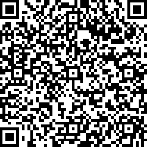
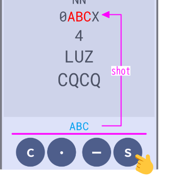
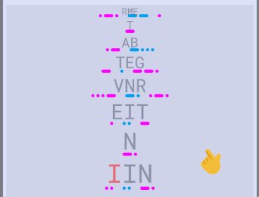
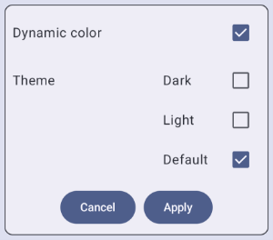
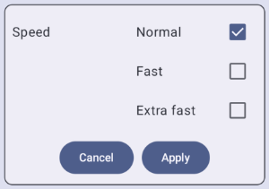
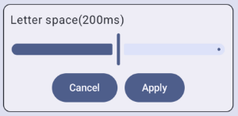
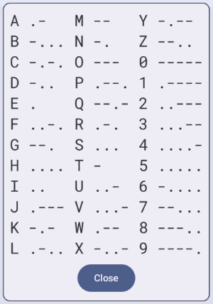

<table align="right">
	<thead>
		<tr>
			<th style="text-align:center">English</th>
			<th style="text-align:center"><a href="index_ja">Japanese</a></th>
		</tr>
	</thead>
</table>
  

"Morse Attack" is a shooter game. Aim and shoot down the letter force attacking from the sky using Morse code. If they reach the ground, it's game over.

Can you defend the ground?!

## Install
You can install it from Google Play.

    

  
  <a href="https://play.google.com/store/apps/details?id=com.studiosuzu.app.morseattack&pli=1">[ Morse Attack ] Google Play</a>

## How to play

### （０）Screen display

### （１）Press the start button

The letter force (enemy) will begin its advance.

### （２）Aim

Use the dash (-) and dot (.) buttons to enter Morse code. After a "letter space" time, the Morse code will be converted to letters.

If you make a mistake, the Cancel (C) button will delete one character. Please re-enter the incorrect character.

When you lock onto a target, it will turn red.

### （３）Shoot down

Press the Shot (S) button to shoot down targets. When an attack hits, the target disappears, and you earn points.

    

### （４）Game over

If the enemy reaches the ground, it's game over.

## Other rules

- Shot hit rate
  
  You can shoot if your aim aligns with certain letters. However, the probability of hitting a target varies. In other words, targets with a low hit rate will require multiple shots to connect.

  | Target | Aiming | Hit rate |
  | ---- | ---- | ----: |
  | ABCD | 1/4 | 25% |
  | ABCD | 2/4 | 55% |
  | ABCD | 3/4 | 75% |
  | ABCD | 4/4 | 100% |

- Points
  
  Points are awarded based on the targets you shoot down. Each shot costs 1 point.

  | | Points | 
Example
 |
  | --- | ---: | --- |
  | 1 Letter | 2 | ABCD ⇒ 2 X 2 - 1 = 3 Points |
  | Complete | 10 | ABCD ⇒ 4 x 2 - 1 + 10 = 17 Points |
  | Shot | -1 | |

  "Complete" means that all the letters are in focus.

## Strategy Guide (Aim for a High Score!)

- Analyze
  
  Don't worry if you encounter characters you don't remember the Morse code for! Try using the "Analyze" function.

  Tapping the screen will perform the analysis and display the Morse code on the screen, but only for 5 seconds.

    

- Aim lock
  
  When you shot, the aim locks onto your target. Once locked on, you can fire continuously.

  To unlock, press another button.

- Random shotting

  ** Coming Soon **

## Options

- Theme change

  You can change the theme from <mark style="background-color: lightgray">Menu>Theme</mark>. "Default" will follow your device's settings.
   
  ※Dynamic Color is available on Android 12 and later.

    

- Speed ​​setting

  You can change the enemy's starting movement speed from <mark style="background-color: lightgray">Menu>Speed</mark>.

    

- Adjusting letter space

  You can change the "Letter space" from <mark style="background-color: lightgray">Menu>Morse</mark>.

    

- List of Morse code

  You can view a list of Morse code characters from <mark style="background-color: lightgray">Help</mark>. The characters displayed here are the characters that appear in the game.

    

## Privacy Policy

  <a href="https://morseattack.github.io/pp/privacy_policy_en.html">Privacy Policy</a>

## Inquiries

StudioSuzu.Support@gmail.com

---
※QR Code is a registered trademark of DENSO WAVE INCORPORATED in Japan and in other countries.