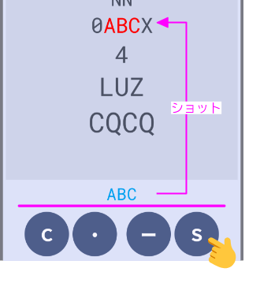

<table align="right">
	<thead>
		<tr>
			<th style="text-align:center"><a href="index">英語</a></th>
			<th style="text-align:center">日本語</th>
		</tr>
	</thead>
</table>
  

「Morse Attack」はシューティングゲームです。上空から攻めて来る文字列軍団を、モールス符号で照準を合わせて、撃ち落としてください。地上まで攻め込まれたらゲームオーバーです。

さあ、あなたは地上を守り切ることが出来るか！！

## インストール
Google Playからインストールできます。

    

  
  <a href="https://play.google.com/store/apps/details?id=com.studiosuzu.app.morseattack&pli=1">[ Morse Attack ] Google Play</a>

## 遊び方

### （０）画面表示

### （１）スタートボタンを押す

文字列軍団（敵）の進軍が開始されます。

### （２）照準を合わせる

ダッシュ（-）とドット（.）ボタンを操作してモールス符号を入力して下さい。レタースペース分の時間が経過すると、モールス符号は文字に変換されます。

入力を間違えたら、キャンセル（C）ボタンで１文字が消えます。間違えた文字を再入力して下さい。

照準が合うと、ターゲットは赤くなります。

### （３）撃ち落とす

ショット（S）ボタンでターゲットを撃ち落とします。攻撃が当たると、ターゲットは消滅します。そして、得点が入ります。

    

### （４）ゲームオーバー

地上まで攻め込まれたら、ゲームオーバーです。

## その他ルール

- ショットのヒット率
  
  照準は一部の文字に合っていれば、ショット出来ます。しかし、当たる確率（ヒット率）が異なります。つまり、ヒット率の低いターゲットは、何回もショットを打たないと、攻撃が当たりません。

  | ターゲット | 照準 | ヒット率 |
  | ---- | ---- | ----: |
  | ABCD | 1/4 | 25% |
  | ABCD | 2/4 | 55% |
  | ABCD | 3/4 | 75% |
  | ABCD | 4/4 | 100% |

- 得点
  
  得点は撃ち落としたターゲットによって異なります。また、ショットは1ポイントを消費します。

  | | 得点 | 
例
 |
  | --- | ---: | --- |
  | 1文字 | 2 | ABCD ⇒ 2 X 2 - 1 = 3点 |
  | コンプリート | 10 | ABCD ⇒ 4 x 2 - 1 + 10 = 17点 |
  | ショット | -1 | |

  「コンプリート」とは、すべての文字に照準が合った状態をいいます。

## 攻略法（高得点をめざせ！）

- アナライズ
  
  モールス符号を覚えていない文字が登場しても大丈夫！アナライズ機能を使ってみて下さい。

  スクリーンをタップすると解析が行われ、スクリーン上にモールス符号を表示します。ただし、５秒間だけです。

    

- 照準ロック
  
  ショットすると、照準はロックされます。ロック後は連続で撃てます。

  ロックの解除は他のボタンを押してください。

- 乱れ打ち

  ** 近日公開 **

## オプション機能

- テーマ変更

  <mark style="background-color: lightgray">Menu>Theme</mark>からテーマの変更が可能です。「Default」は端末の設定に従います。
   
  ※ダイナミックカラーはAndroid 12以降で利用できます。

    

- スピード設定

  <mark style="background-color: lightgray">Menu>Speed</mark>からゲーム開始時の敵の進軍スピードを変更できます。

    

- レタースペース調整

  <mark style="background-color: lightgray">Menu>Morse</mark>からレタースペースを変更できます。

    

- モールス符号一覧

  <mark style="background-color: lightgray">Help</mark>からモールス符号の一覧が表示できます。ここに表示される文字がゲームに登場する文字です。

    

## プライバシーポリシー

  <a href="https://morseattack.github.io/pp/privacy_policy_ja.html">プライバシーポリシー</a>

## 問い合わせ先

StudioSuzu.Support@gmail.com

---
※QRコードは「株式会社デンソーウェーブ」の登録商標です。